# Application Android – Gestion des Étudiants  
Web Service PHP + MySQL + Volley + Gson

## Description du Projet

Ce projet consiste à développer une application Android connectée à une base de données MySQL via un Web Service PHP.

L’application permet de :

- Ajouter un étudiant
- Afficher la liste complète des étudiants
- Modifier un étudiant
- Supprimer un étudiant
- Actualiser dynamiquement la liste après chaque opération

---

# Partie 1 – Base de Données MySQL

## Création de la base

```sql
CREATE DATABASE school1;
```

## Création de la table

```sql
CREATE TABLE student (
    id INT AUTO_INCREMENT PRIMARY KEY,
    nom VARCHAR(50),
    prenom VARCHAR(50),
    ville VARCHAR(50),
    sexe VARCHAR(10)
);
```

## Aperçu Base de Données (phpMyAdmin)

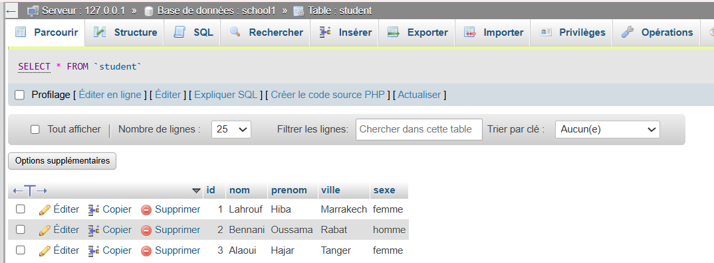

---

# Partie 2 – Web Service PHP (Architecture REST)

## Structure du projet backend

```
lab8/
│
├── connexion/
├── dao/
├── service/
├── ws/
```
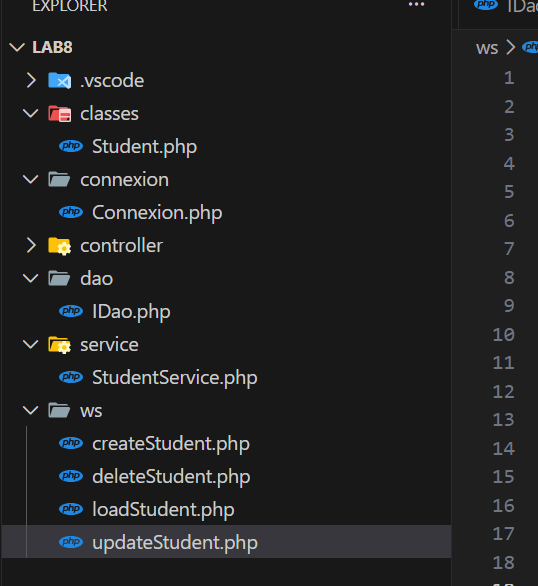
## Web Services Implémentés

| Méthode | Fichier | Description |
|----------|----------|--------------|
| POST | createStudent.php | Ajouter un étudiant |
| GET | loadStudent.php | Charger tous les étudiants |
| POST | updateStudent.php | Modifier un étudiant |
| POST | deleteStudent.php | Supprimer un étudiant |

Toutes les réponses sont retournées au format JSON.

---

## Test avec Postman

### Ajouter un étudiant

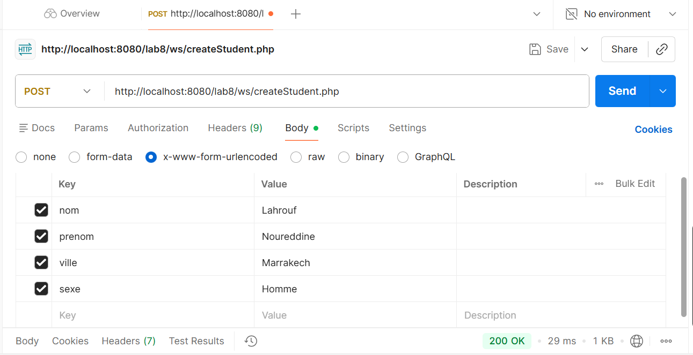
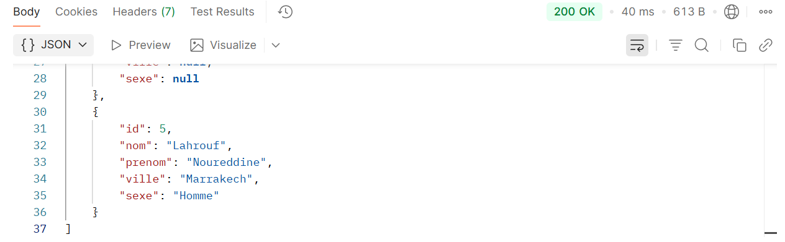
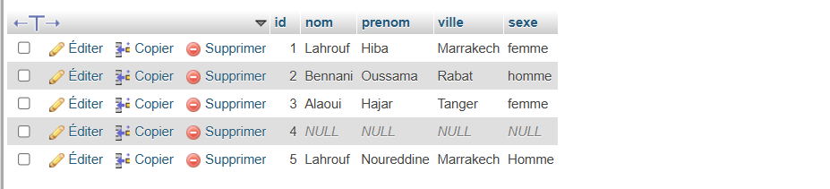
### Charger les étudiants

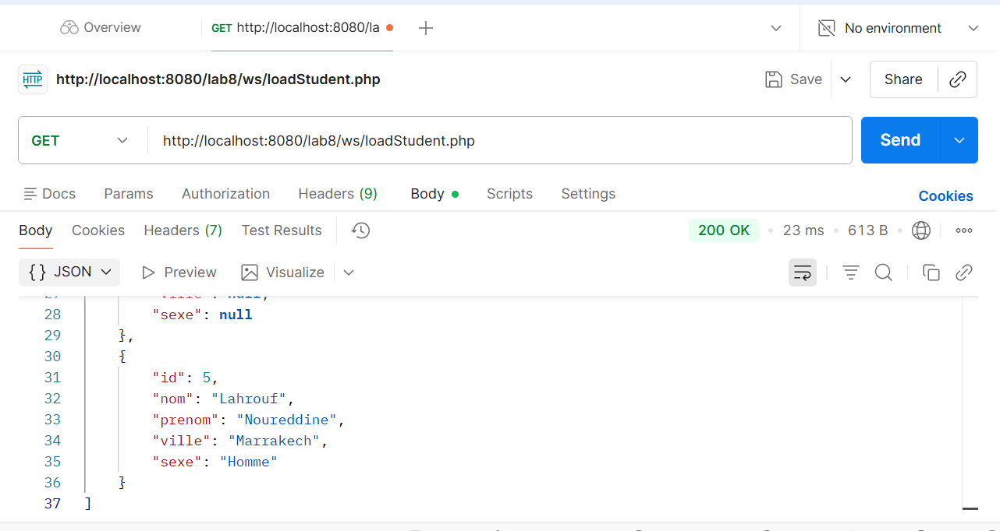

### Modifier un étudiant

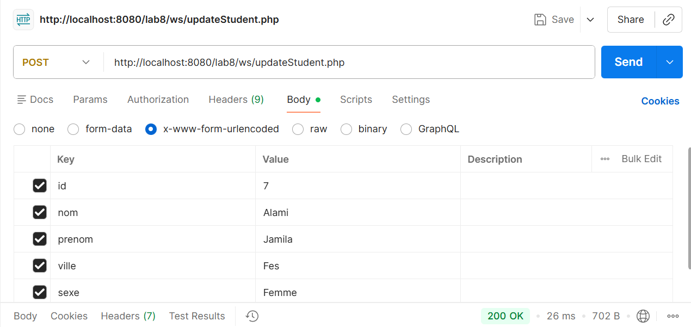
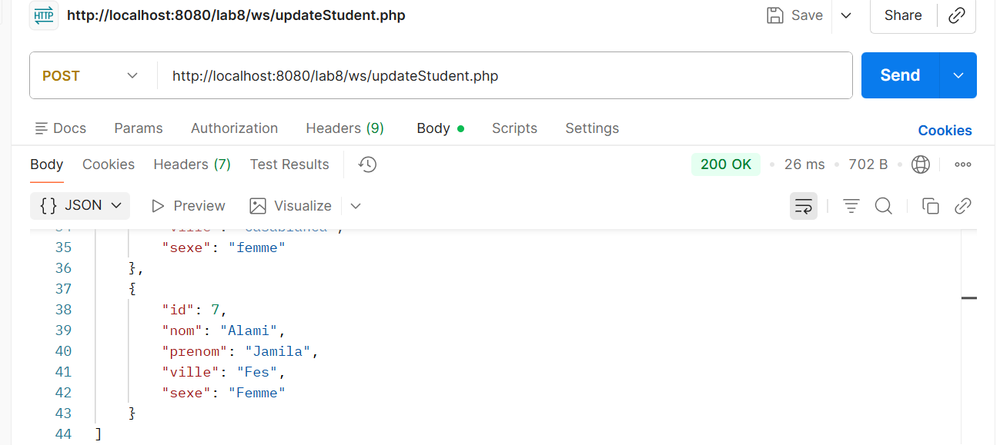

### Supprimer un étudiant

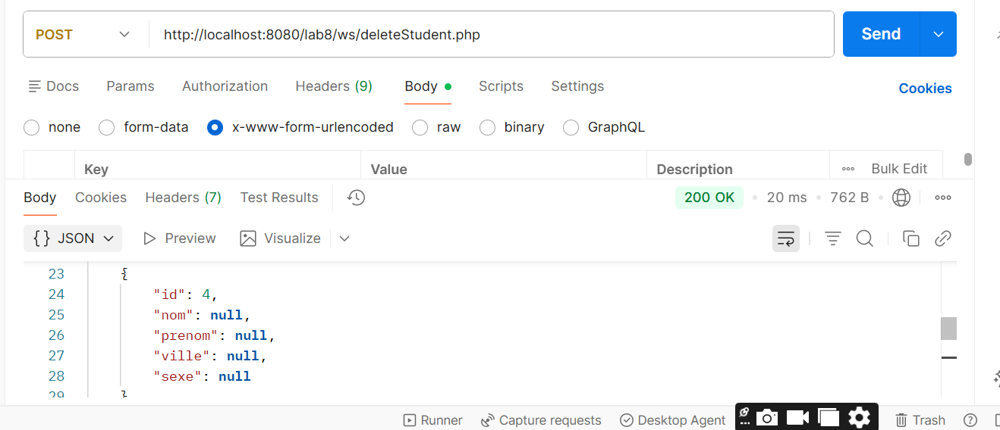
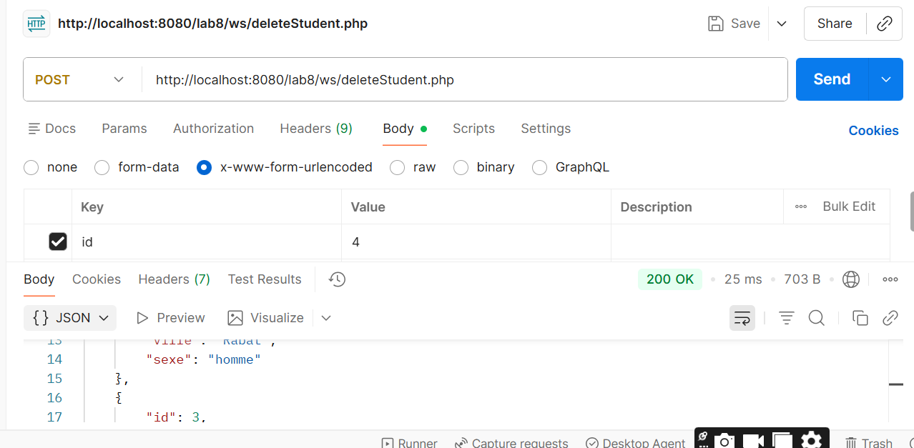
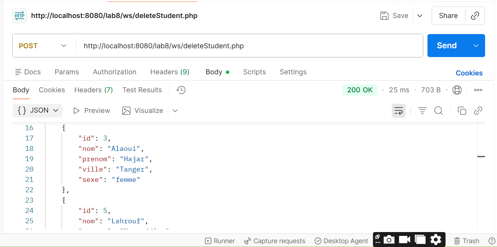
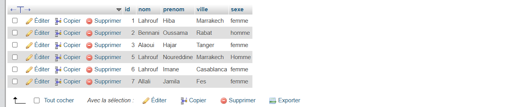

---

# Partie 3 – Application Android

## Technologies utilisées

- Java
- Volley (requêtes HTTP)
- Gson (parsing JSON)
- ListView
- AlertDialog
- Spinner
- RadioButton

---

# Fonctionnalités Implémentées

## 1. Ajouter un étudiant

Formulaire contenant :

- Nom
- Prénom
- Ville (Spinner)
- Sexe (RadioButton)
- Bouton ADD

Après validation :

- Envoi des données au Web Service
- Insertion en base de données
- Réponse JSON retournée

### Interface Ajout

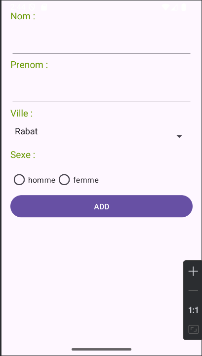
# Démonstration Vidéo


[](https://drive.google.com/file/d/19a-b9nxB7wSNbgeD2zqcGter7mn7N9j-/view?usp=sharing)


---

# Étape 4.8 – Challenge

## Objectif

Créer une activité affichant la liste complète des étudiants avec :

- Clic sur un élément
- Popup d’actions (Modifier / Supprimer)
- Confirmation avant suppression
- Actualisation dynamique après chaque opération

---
---

## 2. Afficher la liste des étudiants

- Utilisation d’un ListView
- Adaptateur personnalisé EtudiantAdapter
- Chargement automatique via loadStudent.php
- Bouton Refresh
  
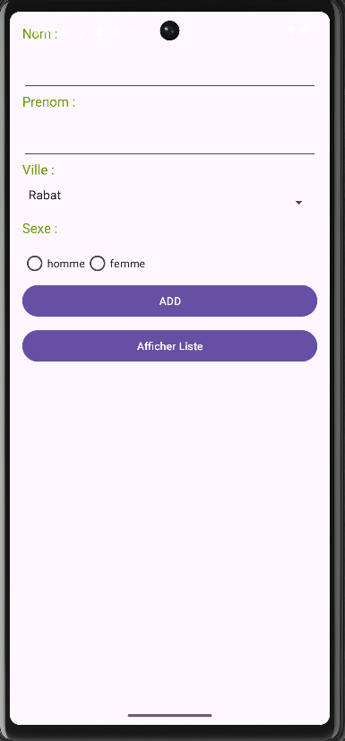


### Liste des étudiants

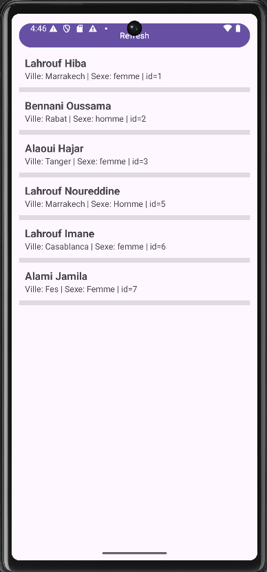


## Popup d’actions

Lorsqu’on clique sur un étudiant :

- Modifier
- Supprimer

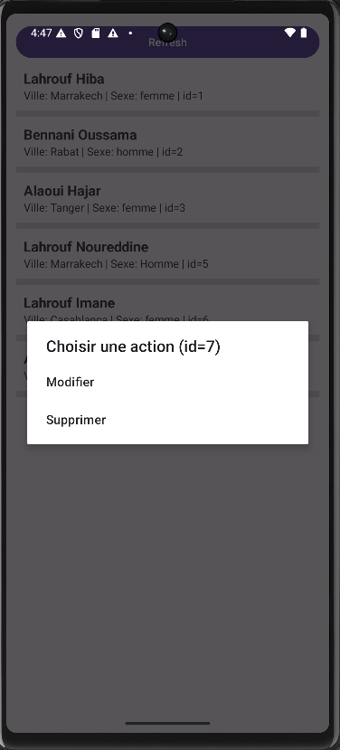

---

## Suppression avec Confirmation

- Affichage d’un AlertDialog
- Confirmation obligatoire
- Envoi vers deleteStudent.php
- Mise à jour automatique de la liste

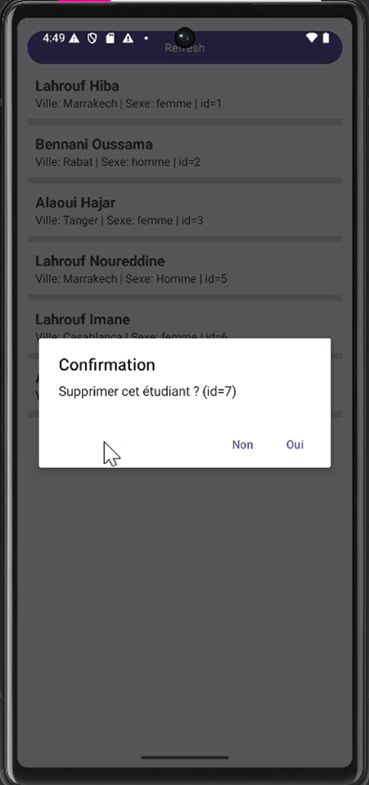
---

## Modification

- Popup personnalisé avec champs pré-remplis
- Envoi vers updateStudent.php
- Rafraîchissement automatique

---

# Actualisation Dynamique

Après chaque opération (Ajout / Modification / Suppression) :

```java
adapter.notifyDataSetChanged();
```

La liste se met à jour automatiquement sans redémarrer l’activité.

---


# Démonstration Vidéo


[](https://drive.google.com/file/d/1x9NhUGi3Cn7Qjc-XNa4Wskjf_HxoWd1k/view?usp=sharing)


---


